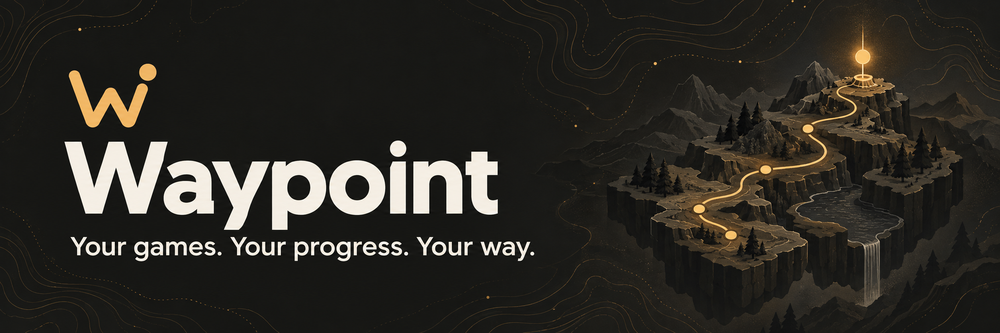

<p align="center">
  
</p>

<h1 align="center">Waypoint</h1>

<p align="center"><strong>Your games. Your progress. Your way.</strong></p>

<p align="center">
  An open-source game launcher with save backups in your own Google Drive.
</p>

<p align="center">
  <a href="https://github.com/kjhq/hydra-drive/actions/workflows/drive-validation.yml"></a>
  <a href="LICENSE"></a>
  
</p>

<p align="center">
  <a href="docs/google-drive-saves.md">Save backup guide</a> ·
  <a href="#build-from-source">Build from source</a> ·
  <a href="https://github.com/kjhq/hydra-drive">Repository</a>
</p>

## Pick up where you left off

Waypoint brings your library, game launching, and save history together. Keep
snapshots in a visible **Waypoint Saves** folder in your Google Drive, restore an
earlier version, and choose which supported games sync automatically.

Save backups don't require a Hydra account or subscription. Waypoint is built on
Hydra; its catalogue, downloads, social features, and other online integrations
still use separate upstream services.

> **Development preview** — Waypoint is not yet qualified for public release.
> Google OAuth production setup and live Windows, Linux, and Steam Deck testing
> remain in progress. Keep an independent copy of important saves when testing.

## A home for your games and progress

| Feature                    | What you can do                                                                                                                              |
| -------------------------- | -------------------------------------------------------------------------------------------------------------------------------------------- |
| **Your saves, your Drive** | Back up PC saves and supported emulator saves to your own Google Drive.                                                                      |
| **A history to return to** | Browse snapshots and restore earlier progress. Conflicting saves remain separate for you to choose; game files are not automatically merged. |
| **Sync on your terms**     | Start with manual backups, then opt supported games into automatic sync. Manual-only formats stay manual.                                    |
| **Your library, together** | Organize and launch games you own, browse the catalogue, and use supported emulator integrations.                                            |
| **Desktop or controller**  | Use the desktop interface or Big Picture mode, with platform and controller qualification still in progress.                                 |

## Start with your saves

Once you've built and configured a development version:

1. Add a game whose saves are already on your device.
2. Connect Google Drive in **Settings → Cloud saves**.
3. Check the game's detected save folders, or choose a custom folder, and create
   a manual backup.
4. Check your backup history before enabling automatic sync for supported games.

If your only copy is in Hydra Cloud, restore it with official Hydra first.
See the [save backup guide](docs/google-drive-saves.md) for recovery, account
switching, supported save behavior, and release qualification requirements.

## Build from source

Use **Node.js 22.21.0** (the version used in validation CI), **Yarn Classic
1.22.22**, a stable Rust toolchain, Git, and your platform's native build tools:

- **Windows:** Visual Studio C++ Build Tools.
- **Linux:** a C/C++ toolchain and the dependencies listed in the
  [validation workflow](.github/workflows/drive-validation.yml).
- **macOS development:** Xcode command-line tools. The current release
  qualification targets Windows and Linux/Steam Deck.

```sh
git clone https://github.com/kjhq/hydra-drive.git waypoint
cd waypoint
yarn --frozen-lockfile
```

Copy `.env.example` to `.env` and configure the service settings described in
the [build configuration guide](docs/google-drive-saves.md#build-configuration).
For Google Drive development, follow the
[maintainer OAuth setup](docs/google-oauth-setup.md). The maintainer supplies the
Google app configuration; end users should not need to create a Google project.

```sh
yarn dev
```

Dependency installation builds the native addon, including its pinned
libtorrent bridge. For local validation:

```sh
yarn typecheck
yarn test
yarn test:native-saves
yarn build
```

For Windows or Linux packages, run `yarn build:win` or `yarn build:linux` on the
corresponding platform. These commands do not publish a release. See
[Drive save validation](https://github.com/kjhq/hydra-drive/actions/workflows/drive-validation.yml)
for automated build results; passing CI does not replace live-account and device
testing.

## Contributing

The repository's [issue tracker](https://github.com/kjhq/hydra-drive/issues) is
currently disabled. Code contributions can be submitted as
[pull requests](https://github.com/kjhq/hydra-drive/pulls). For privacy or security
enquiries, see the [support page](docs/site/support.html).

For changes, include the relevant validation results and keep documentation in
step with the behavior. Save and restore changes also need the recovery and
account-isolation checks in the [save backup guide](docs/google-drive-saves.md).

## Built on open source

Waypoint is an independent fork of [Hydra Launcher](https://github.com/hydralauncher/hydra),
created by Los Broxas and its contributors. Thank you to the upstream community
for the foundation. Waypoint is not affiliated with or endorsed by the upstream
Hydra project or Google.

Licensed under the [MIT License](LICENSE). The original copyright and license
notices are preserved.
